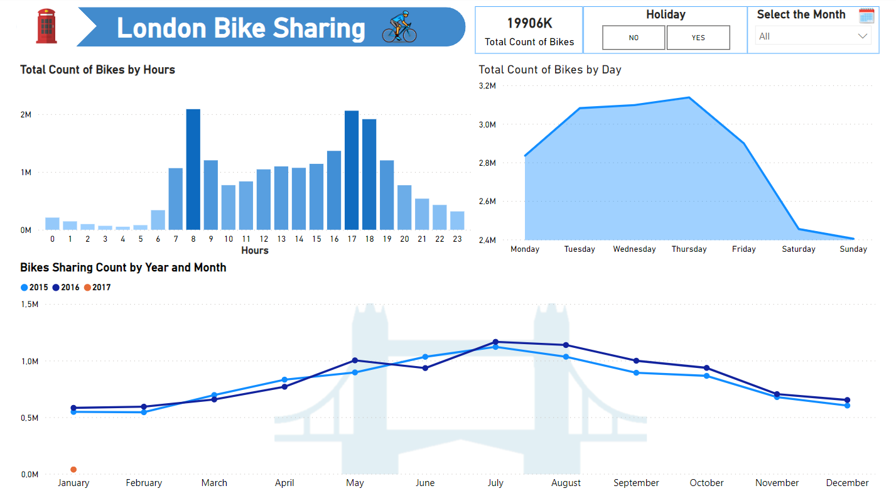
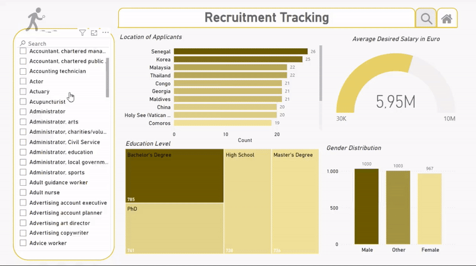

# my Portfolio 📊
Welcome to my Data Analysis Portfolio! This repository serves as a collection of diverse analyses and explorations in different fields, showcasing my skills and insights gained through various projects.

## Overview
Here, you'll find a variety of analyses, each addressing unique questions and challenges within different domains.This portfolio reflects my passion for extracting meaningful insights from data. You can find the stories of the datasets and the details of my codes in the notebook.

## Sales Analysis 🏷️
Exploration of sales data, answering key questions and visualizing patterns.
Mainly Tools Used: Python, Pandas, Matplotlib, Seaborn.

### Key Insights: 
- Best Month for Sales

- Top-Sales City

- Optimal Advertisement Timing

- Frequently Sold Together

- Best-Selling Product
  
🔗 *Go to [JupyterNotebook](2-Project-Sales-Analysis/sales-analysis.ipynb)*

  
## LinkedIn Job Posting Analysis 📈

The findings cover, from top job titles and companies to work type distributions, geographical opportunities, and more.

### About the dataset
This dataset pulls job postings from Google's search results for Data Analyst positions in the United States.
Data collection started on November 4th, 2022, and adds ~100 new job postings to this dataset daily.

You can access the raw version of the data set [here](https://www.kaggle.com/datasets/lukebarousse/data-analyst-job-postings-google-search) . 

### Key Insights:

- Job Titles and Companies: Explore the distribution of job titles and discover the top 50 companies with the most job postings.

- Work Type Comparison: Analyze the distribution of on-site and remote/hybrid job postings, revealing evolving work trends.

- Job Posting Sites: Investigate the 20 most used job posting sites, offering valuable information for job seekers and employers.

- Geographical Analysis: Map the number of job postings by state, providing a visual representation of job opportunities across the USA.

- Work Type Consolidation: Simplify work types, presenting a clear picture of the dominant categories in job postings.

- Visual Work-Type Comparison: Conclude with a visual comparison of work-type distributions using bar plots and a pie chart for a comprehensive view.

🔗 *Go to [JupyterNotebook](1-Project-Job-Analysis/job-analysis.ipynb)*

## Sentiment Analysis and Web Scraping 🌐

This project provides a comprehensive pipeline for scraping Amazon reviews, storing the data in a MySQL database, performing data analysis and sentiment analysis, and visualizing the results through graphs. The use of ScrapeOps Proxy enhances the scraping process, ensuring efficient data extraction from Amazon. The developed solution for handling token limitations demonstrates the project's adaptability and problem-solving approach.

### Key Components:

-	Sentiment Analysis: Analyzing sentiment trends using Python and NLTK.

-	Web Scraping: Extracting Amazon product reviews to gather valuable information.

- Data Storage in MySQL

- Transfer to Jupyter Notebook

- Data Manipulation and Exploratory Data Analysis with Python Libraries

- Sentiment Analysis using Vader and Roberta Models

- Handling Token Limitations

- Data Visualization with Graphs

🔗 *Go to Repo to see detail of [project](https://github.com/omeryurtt/Web-Scraping-and-Sentiment-Analysis/tree/main).*

## Nutrition and Health Tracking Excel Tool 📊🍕

Based on survey results, I have developed an automated Python API to extract data on over 5000 of the most consumed dishes in the USA and organize them into Excel sheets according to user preferences. In addition to providing users with a diverse menu, we offer a dynamic table where they can effortlessly add their recipes. We integrate monthly tracking and body analysis functionalities throughout these processes to enhance user experience. All these features are made user-friendly and interactive through VBA codes, ensuring a seamless and engaging platform for users.

### Key Functions:
-  API Integration
-  Data Organization and Excel Refinement: Excel functions, such as XLOOKUP, INDIRECT, Conditional Formatting, and more, to organize and manipulate the food dataset efficiently.
-  Efficient Search Feature
-  Personalized Consultation
-  Meal Planning
-  Comprehensive Monthly Tracking
-  Interactive Functionality: Implemented VBA scripts for user-friendly buttons, enhancing the tool’s functionality. Utilized Excel functions for real-time data manipulation and visualization.

  
.gif)

.gif)

🔗 *Go to Repo to see detail of [project](https://github.com/omeryurtt/NutriTrack_Excel_Tool).*

# 
  Microsoft Power BI Project   

World of Data Professionals, explore the world of Data Professionals with insights on their working conditions, annual salaries based on experience, the most sought-after job titles, and the intriguing comparison between earnings in large and small companies.

## Dashboard Highlights

1. **Annual Average Gross Salary by Experience Level in USD**

2. **Top 10 Most Sought-After Job Titles by Experience Levels**

3. **Distribution of Experience Levels Among Employees in Companies, Stratified by Workforce Size**

4. **Distribution of Remote, Hybrid, and On-site Work Environment**
   
5. **Filtered Search by Job Title, Experience Level, Year**

 

🔗 *Go to Repo to see detail of [project](https://github.com/omeryurtt/Microsoft-Power-BI).*

## London-Bike-Sharing 🚲

Alongside PowerBI, I explored and analyzed the raw data using Python, utilizing libraries such as Pandas and Seaborn. You can review my Jupyter Notebook, where you will find a summary of the data visualizations that provide answers to questions.

### Questions:

1. **How many bikes shared annually, monthly and daily?**

2. **How many bike shared by Seasons?**

3. **What is seasonal demand per hours for bikes?**
   
4. **What is hourly bike share by day?**
   
5. **Comparison of demand for bicycles on holidays and weekends?**

6. **Biking Demand by Day of the Week (Percentage) & Seasonal Demand per Day for Bikes (Counts)**

7. **What is the correlation between weather condition and bike sharing?**

🔗 **[Explore Jupyter Notebook](5-Project-PowerBI/London-Bike-Sharing/london-bike-sharing-analysis.ipynb)**

🔗 **[Explore Dashboard](5-Project-PowerBI/London-Bike-Sharing/London-Bikes-Sharing.pbix)**

   

## Recruitment Tracking Dashboard 💼

Recruitment Dashboard, a powerful tool designed to streamline and enhance the recruitment process. This interactive dashboard, crafted using mock data, provides valuable insights into the demographic characteristics, education levels, experience, and salary expectations of job applicants. Additionally, it offers a user-friendly interface for effectively tracking the status of each application in the recruitment pipeline.

### Dashboard Highlights

1. **Demographic Overview**

2. **Education Insights**

3. **Experience Analysis**

4. **Salary Expectations**

5. **Process Tracking**

🔗 **[Explore Dashboard](5-Project-PowerBI/Recruitment-Tracking/Recrutiment%20Tracking.pbix)**

## Connect with Me 📞
➤ [LinkedIn](https://www.linkedin.com/in/omer-yurt/)
➤ e-mail: omeryurt2001@gmail.com

## Acknowledgments ✨
**Thank you for exploring my portfolio! If you have any questions or feedback, feel free to reach out.**

  
 📢 If you have any suggestions, questions, or ideas, I am all ears! Your input is invaluable, and I would appreciate it if you could help improve my codes. Feel free to reach out with your feedback; it would be greatly welcomed!🧐
